AI Resume Screener

An AI-powered tool to automatically screen resumes against job descriptions using semantic search and vector databases.
The system extracts skills from resumes, compares them with job descriptions, and provides:

1) Skills to Add
2)Skills to Remove
3) Match Score

🚀 Features

1)Upload resume (PDF format).

2)Extracts text from resumes.

3)Embeds skills into vector space using semantic embeddings.

4)Stores resume embeddings in Qdrant Vector Database.

5)Accepts a job description as input.

6)Generates embeddings for the job description.

7)Performs semantic search between resume and job description embeddings.

8)Returns:

8.1)Skills to be added.

8.2)Skills to be removed.

8.3)Match score (%) between resume and job description.

*Image before uploading the resume*:

*Image of the final result*:

Flow of the project:-

```mermaid
flowchart TD
    %% ===== Resume ingestion =====
    A["Upload Resume (PDF)"] --> B["Extract Text from PDF"]
    B --> C["Generate Resume Embeddings"]
    C --> D["Store in Qdrant (upsert)"]

    %% ===== Job description matching =====
    E["Enter Job Description"] --> F["Generate JD Embeddings"]
    F --> G["Query Qdrant (vector search)"]
    G --> H["Top-k Similar Resume Chunks"]

    %% ===== Aggregation & results =====
    H --> I["Compare JD vs Resume Skills"]
    I --> J["Results: Match Score • Skills to Add/Remove"]

    %% ===== Explicit connection between store & search =====
    D <--> G
```

⚙️ Flow Explanation

Resume Upload (PDF)

User uploads a PDF resume.

PDF text is extracted and cleaned.

Embedding Creation

Resume text is converted into vector embeddings using an embedding model (e.g., OpenAI, HuggingFace, etc.).

Vector Storage (Qdrant)

Embeddings are stored in Qdrant Vector Database for efficient semantic similarity search.

Job Description Input

User pastes the job description.

The JD is also converted into embeddings.

Semantic Search

Resume embeddings are compared with JD embeddings.

Qdrant returns the most relevant matches (skills and keywords).

Result Generation

Extracts overlapping skills.

Identifies missing skills (Skills to Add).

Flags irrelevant skills (Skills to Remove).

Computes a Match Score (%) to quantify the resume-job fit.

🐳 Running Qdrant with Docker

This project uses Qdrant as the vector database.
You can spin it up quickly with Docker:

docker run -p 6333:6333 qdrant/qdrant

Qdrant will be available at: http://localhost:6333

Default REST API → http://localhost:6333

Default gRPC API → http://localhost:6334

🛠️ Tech Stack

Frontend: HTML/CSS/JS

Backend: FastAPI 

NLP: Embedding model (Groq)

Database: Qdrant Vector Database (via Docker)

PDF Processing: PyPDF2 

Frameworks: Langchain

📌 Future Enhancements

Multi-resume comparison for bulk hiring.

ATS-friendly resume formatting.

Advanced scoring metrics (weighting skills by importance).

Integration with LinkedIn/Job boards.

:

🤝 Contributing

Contributions, issues, and feature requests are welcome!
If you’d like to improve this project:

Fork the repository

Create a new branch (git checkout -b feature-new-idea)

Commit your changes (git commit -m 'Add new feature')

Push to your branch (git push origin feature-new-idea)

Open a Pull Request

⭐ If you find this project helpful, don’t forget to star the repo and share it!
